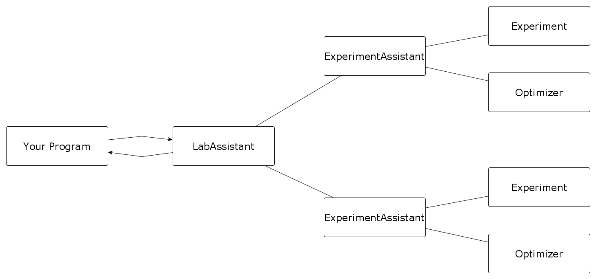
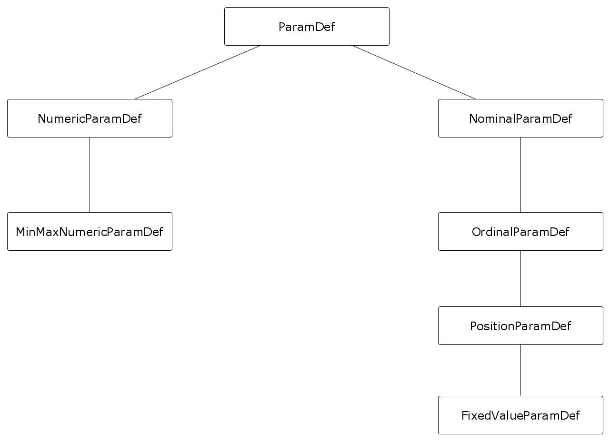

 
Design
======

Overview
--------

   
In general, the building blocks of apsis are :class:`Experiments <apsis.models.experiment.Experiment>`. An experiment corresponds to a series of evaluations, the result of which should be optimized. To store the results, the :class:`Candidates <apsis.models.candidate.Candidate>` exist. Each candidate corresponds to one evaluation of the experiment. It stores the parameters used for the evaluation, and eventually the result.

For administration of an experiment, you can use :class:`ExperimentAssistants<apsis.assistants.experiment_assistant.PrettyExperimentAssistant>`. They store their corresponding experiment and an optimizer, and let communicate with the outside. This communication happens mostly via two functions: update and next_candidate. next_candidate gives you the next parameter combination one should try out. update allows you to update the ExperimentAssistant with new data.

:class:`Optimizers <apsis.optimizers.optimizer.Optimizer>` are the base for optimization in this module. Each optimizer stores which parameter definitions are supported, and has a single important function: get_next_candidates. This, given an experiment, returns several candidates one should try next. This also means that, by changing the optimizer parameter in ExperimentAssistant, one can hot-swap optimizers.

Since it is quite likely that we have several experiments running at once, we better use the :class:`LabAssistant <apsis.assistants.lab_assistant.PrettyLabAssistant>`. The LabAssistant administrates several experiments, identified by their unique names. Experiments can be compared and plotted in different combinations.

Parameter storage
-----------------

Similar to Scikit-learn, we have decided to store parameters in a dictionary of string keys. The advantage is that the translation from inside the program to the outside is easy, and each parameter is clearly defined. It also makes debugging easier.

Parameter Definitions
---------------------

For Parameter Definitions to work, we have defined a parameter definition tree: Each parameter definition inherits from ParamDef, and inherits from other parameter definitions. The tree is shown below:

   
The reason for this is simple: Since we do not know in advance which optimizers may be implemented, and since one optimizer may not have support for every parameter definition - for example, Bayesian Optimization does not support nominal parameters.
Since each parameter definition inherits from an already existing one, an optimizer just has to support a base class of one to work, and no further work is necessary. If, on the other hand, some special cases for a parameter definition exists, it can be used without a problem.

In general, all parameter definitions inherit from :class:`ParamDef <apsis.models.parameter_definition.ParamDef>`. This defines only two functions: One is the distance between two points from the parameter definition, the other is to test whether a value is part of this ParamDef.

Below of ParamDef, there is a distinction into two different classes. :class:`NumericParamDef <apsis.models.parameter_definition.NumericParamDef>` defines continuous, numeric values. These are defined by their warping functions. Warping maps some undefined parameter space to [0, 1] and back. It is used to make all following parameters conform to the same internal format. While NumericParamDef allows you to specify the warping function yourself, :class:`MinMaxNumericParamDef <apsis.models.parameter_definition.MinMaxNumericParamDef>` predefines a uniform distribution from Min to Max.

On the other side, there is :class:`NominalParamDef <apsis.models.parameter_definition.NominalParamDef>`, which defines a nominal parameter definition. It is defined by a list of possible values. It is extended by :class:`OrdinalParamDef <apsis.models.parameter_definition.OrdinalParamDef>`, which defines an order on that, and :class:`PositionParamDef <apsis.models.parameter_definition.PositionParamDef>` which defines positions for each of its values. That is, the distance between value A and B is the same as the difference between the position of A and the position of B. :class:`FixedValueParamDef <apsis.models.parameter_definition.FixedValueParamDef>` can be used for integer values or similar, and builds on PositionParamDef by defining that position from the value of the values. It can be used to represent any fixed points.