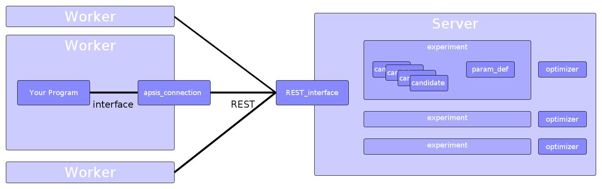

 
Design
======

Overview
--------

   
In general, the building blocks of apsis are :class:`Experiments <apsis.models.experiment.Experiment>`. An experiment corresponds to a series of evaluations, the result of which should be optimized. To store the parameter configuration (and the corresponding result), the :class:`Candidates <apsis.models.candidate.Candidate>` exist. Each candidate corresponds to one evaluation of the experiment. It stores the parameters used for the evaluation, and eventually the result.

The architecture of apsis can be seen in the figure above.

An optimization using apsis consists of two different parts, the server and the workers. The workers are processes running either locally or in a network. They implement your machine learning algorithm, and use the ``apsis_client`` package to communicate with the server via REST. The server itself stores a number of experiments, each uniquely identified via its id. Each experiment stores the evaluated candidates, its parameter definitions and other parameters. Each experiment also has an optimizer assigned. It also generates the overview page you can request via web browser.

In general, your optimization routine will look as follows: You start your worker, which calls the ``get_next_candidate`` funtion of its ``apsis_connection``. Doing so starts activity in the server. Either the experiment currently holds a candidate ready for evaluation, or the optimizer is called to generate a new one. Either way, this candidate is returned. Then, your machine learning algorithm does its part, returning a result. This is returned via the ``update`` function. Doing so usually prompts activity in the server, since the Gaussian process has to be refitted. Once this is done, new candidates are ready to continue optimizing! 

:class:`Optimizers <apsis.optimizers.optimizer.Optimizer>` are the base for optimization in this module. Each optimizer stores which parameter definitions are supported, and has a single important function: get_next_candidates. This, given an experiment, returns several candidates one should try next. This also means that, by changing the optimizer parameter in ExperimentAssistant, one can hot-swap optimizers.

Parameter storage
-----------------

Similar to Scikit-learn, we have decided to store parameters in a dictionary of string keys. The advantage is that the translation from inside the program to the outside is easy, and each parameter is clearly defined. It also makes debugging easier.

Parameter Definitions
---------------------

For Parameter Definitions to work, we have defined a parameter definition tree: Each parameter definition inherits from ParamDef, and inherits from other parameter definitions. The tree is shown below:

.. image:: ./pictures/param_defs_architecture.png
   :width: 75%
   
The reason for this is simple: Since we do not know in advance which optimizers may be implemented, and since one optimizer may not have support for every parameter definition - for example, Bayesian Optimization does not support nominal parameters right now.
Since each parameter definition inherits from an already existing one, an optimizer just has to support a base class of one to work, and no further work is necessary. If, on the other hand, some special cases for a parameter definition exists, it can be used without a problem.

In general, all parameter definitions inherit from :class:`ParamDef <apsis.models.parameter_definition.ParamDef>`. This defines only two functions: One is the distance between two points from the parameter definition, the other is to test whether a value is part of this ParamDef.

Below of ParamDef, there is a distinction into two different classes. :class:`NumericParamDef <apsis.models.parameter_definition.NumericParamDef>` defines continuous, numeric values. These are defined by their warping functions. Warping maps some undefined parameter space to [0, 1] and back. It is used to make all following parameters conform to the same internal format. While NumericParamDef allows you to specify the warping function yourself, :class:`MinMaxNumericParamDef <apsis.models.parameter_definition.MinMaxNumericParamDef>` predefines a uniform distribution from Min to Max. In addition :class:`AsymptoticNumericParamDef <apsis.models.parameter_definition.AsymptoticNumericParamDef>` meets the frequent use case of having parameter that is close to a certain boundary but may never exceed this boundary. For example when optimizing learning rates they are often asymptotic at 0 but must never become 0.

On the other side, there is :class:`NominalParamDef <apsis.models.parameter_definition.NominalParamDef>`, which defines a nominal parameter definition. It is defined by a list of possible values. It is extended by :class:`OrdinalParamDef <apsis.models.parameter_definition.OrdinalParamDef>`, which defines an order on that, and :class:`PositionParamDef <apsis.models.parameter_definition.PositionParamDef>` which defines positions for each of its values. That is, the distance between value A and B is the same as the difference between the position of A and the position of B. :class:`FixedValueParamDef <apsis.models.parameter_definition.FixedValueParamDef>` can be used for integer values or similar, and builds on PositionParamDef by defining that position from the value of the values. It can be used to represent any fixed points.

Each ParamDef, however, still defines a warping function. However, the we can assume that the NominalParamDef's warping is not very good, since it is a simple hypercube.
