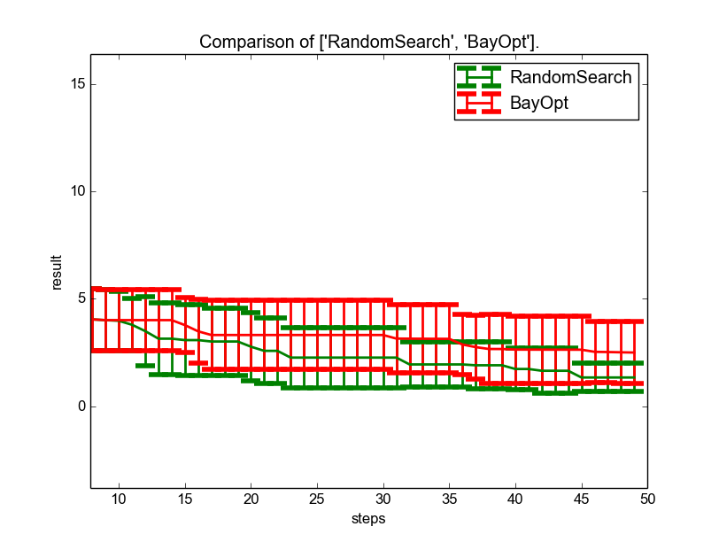
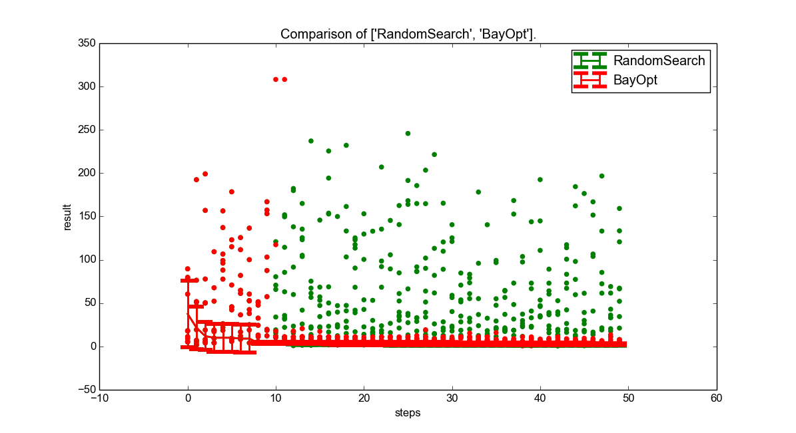
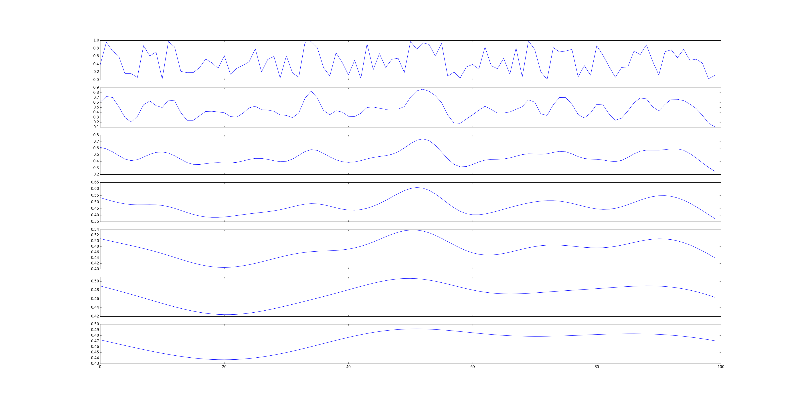
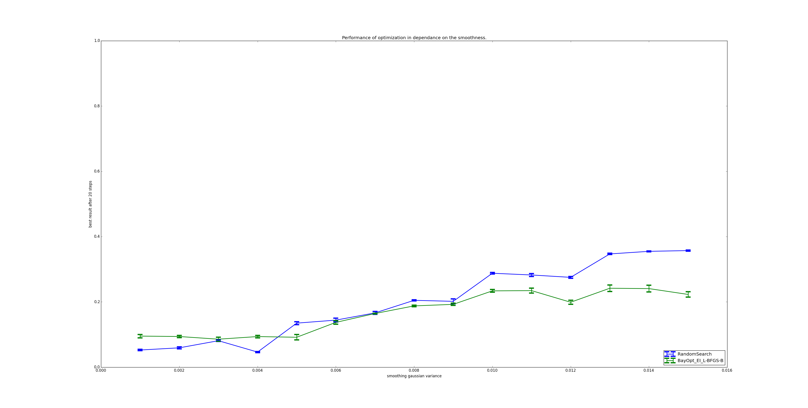
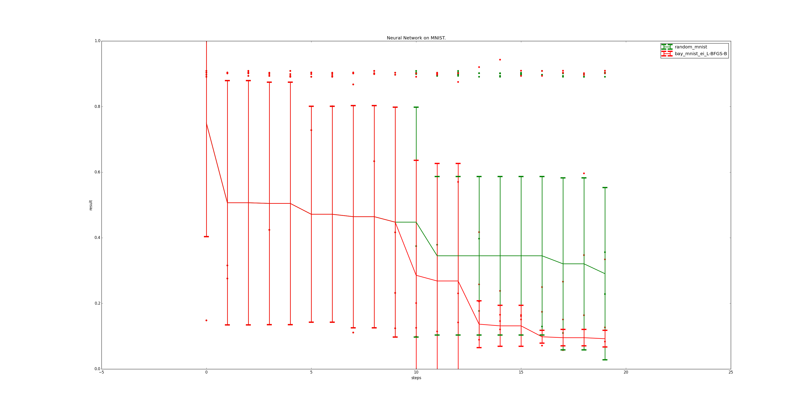
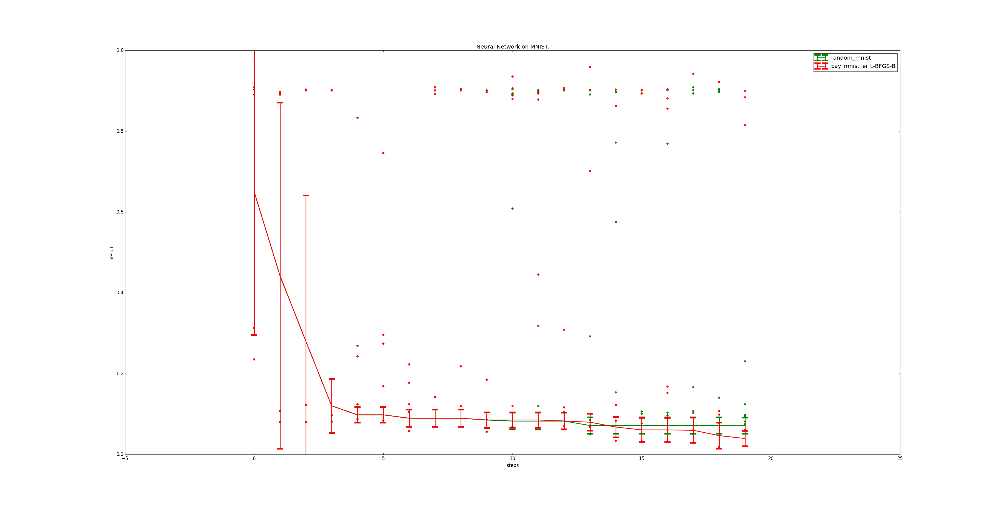

Evaluation
==========

Overview
--------
This section evaluates apsis on several benchmark and one real world example. All experiments are evaluated using cross validation and 10 initial random samples that are shared between all optimizers in an experiment to ensure comparability.

Branin-Hoo Benchmark
--------------------
Some recent papers on Bayesian Optimization for machine learning publish evaluations on the Branin Hoo optimization function. The Branin Hoo function 

.. math::

    f_\text{Branin}(x) = a \cdot (y - b\cdot x^{2} + c \cdot x - r)^{2} + s \cdot (1-t) \cdot cos(x) + s

using values proposed `here <http://www.sfu.ca/~ssurjano/branin.html>`_ is defined as

.. math::

    f_\text{Branin}(x) = (y - \frac{5.1}{4 \pi^{2}}\cdot x^{2} + \frac{5}{\pi} \cdot x - 6)^{2} + 10 \cdot (1- \frac{1}{8 \pi}) \cdot cos(x) + 10.

In contrast to our expectations Bayesian Optimization was not able to outperform random search on Branin Hoo. Still the result is much more stable and the bayesian optimizer samples only close to the optimum.

   
   Comparison of Bayesian Optimization vs. random search optimization on Branin Hoo function. The upper picture shows the best result in every step. Here, random search clearly outperforms Bayesian Optimization. The right plot additionally plots each function evaluation as a dot. Here, it is apparent that Bayesian Optimization works a lot more stable and does not evaluate as many non-promising candidates as random search.
   

Evaluation on Multidimensional Artificial Noise Function
--------------------------------------------------------

   
   Plot of artificial noise function used as an optimization benchmark in apsis. This is generated using a grid of random values smoothed over by a gaussian of varying variance.

Compared to random search an intelligent optimizer should be better on less noisy function than on very noisy functions in theory. A very noisy function has a tremendous amount of local extrema making it hard to impossible for Bayesian Optimization methods to outperform random search. To investigate this proposition an artificial multidimensional noise function has been implemented in apsis as shown above.

Using this noise function, one can generate multi-dimensional noises with varying smoothness. The construction process first constructs an $n$-dimensional grid of random points, which remains constant under varying smoothness. Evaluating a point is done by averaging the randomly generated points, weighted by a gaussian with zero mean and varying variance. This variance influences the final smoothness. A one-dimensional example of generated functions for differing variances can be seen above.

   
   Plot of the end result after 20 optimization steps on a 3D artificial noise problem depending on the smoothing used. Values to the right are for smoother functions. A lower result is better.

The result can be seen in figure above. As expected, Bayesian Optimization outperforms random search for smoother functions, while achieving a rough parity on rough functions.

Evaluation on Neural Network on MNIST
-------------------------------------

To evaluate the hyperparameter optimization on a real world problem, we used it to optimize a neural network on the `MNIST dataset <http://yann.lecun.com/exdb/mnist/>`_. We used `Breze <https://github.com/breze-no-salt/breze>`_ as a neural network library in Python.
The network is a simple feed-forward neural network with 784 input neurons, 800 hidden neurons and 10 output neurons. It uses sigmoid units in the hidden layers, and softmax as output. We learn over 100 epochs. These parameters stay fixed throughout the optimization.
For assigning the neural network weights, we use a backpropagation algorithm. 

Its parameters - step_rate, momentum and decay - are optimized over, as is $c_{wd}$, a weight penalty term, resulting in a four dimensional hyperparameter optimization.
We ran all neural network experiments with a five-fold cross validation. Even so, total evaluation time ran close to 24 hours on an Nvidia Quadro K2100M.

   
   Comparison of random search and Bayesian Optimization in the context of a neural network. Each point represents one parameter evaluation of the respective algorithm. The line represents the mean result of the algorithm at the corresponding step including the boundaries of the 75% confidence interval.

The figure above shows the performance of the optimizers for each step. As can be seen, Bayesian Optimization - after the first ten, shared steps, rapidly improves the performance of the neural network by a huge amount. This is significantly more stable than the random search optimizer it is compared with.

However, the optimization above uses no previous knowledge of the problem. In an attempt to investigate the influence of such previous knowledge, we then set the parameter definition for the step_rate to assume it to be close to 0, and the decay to be close to 1. This is assumed to be knowledge easily obtainable from any neural network tutorial.

   
   Comparison of random search and Bayesian Optimization in the context of a neural network. This optimization uses additional knowledge in that step\_rate is assumed to be close to 0 and decay to be close to 1.

The effects of this can be seen in above, and are dramatic. First of all, even random search performs significantly better than before, reaching a similar value as the uninformed Bayesian Optimization. Bayesian optimization profits, too, and decreases the mean error by about half.